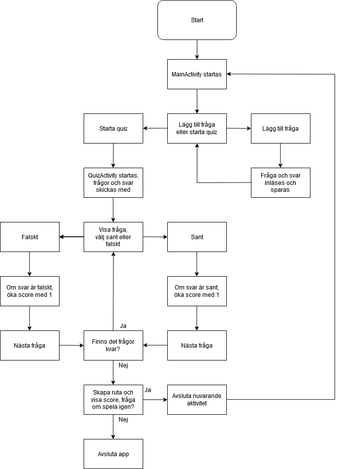

## quizApp
quizApp is a simple app which allows its users to add truth and false questions - and then start a quiz with questions added.

The app was built for the course [EITG01 Dator- och telekommunikation](https://www.eit.lth.se/kurs/eitg01) at Lunds Tekniska Högskola. 

### Disclaimer
quizApp is very rudimentary, and lack many features. This is just a proof of concept.

### Flowchart

### Authors
Johan Wulf and Max Palmgren
